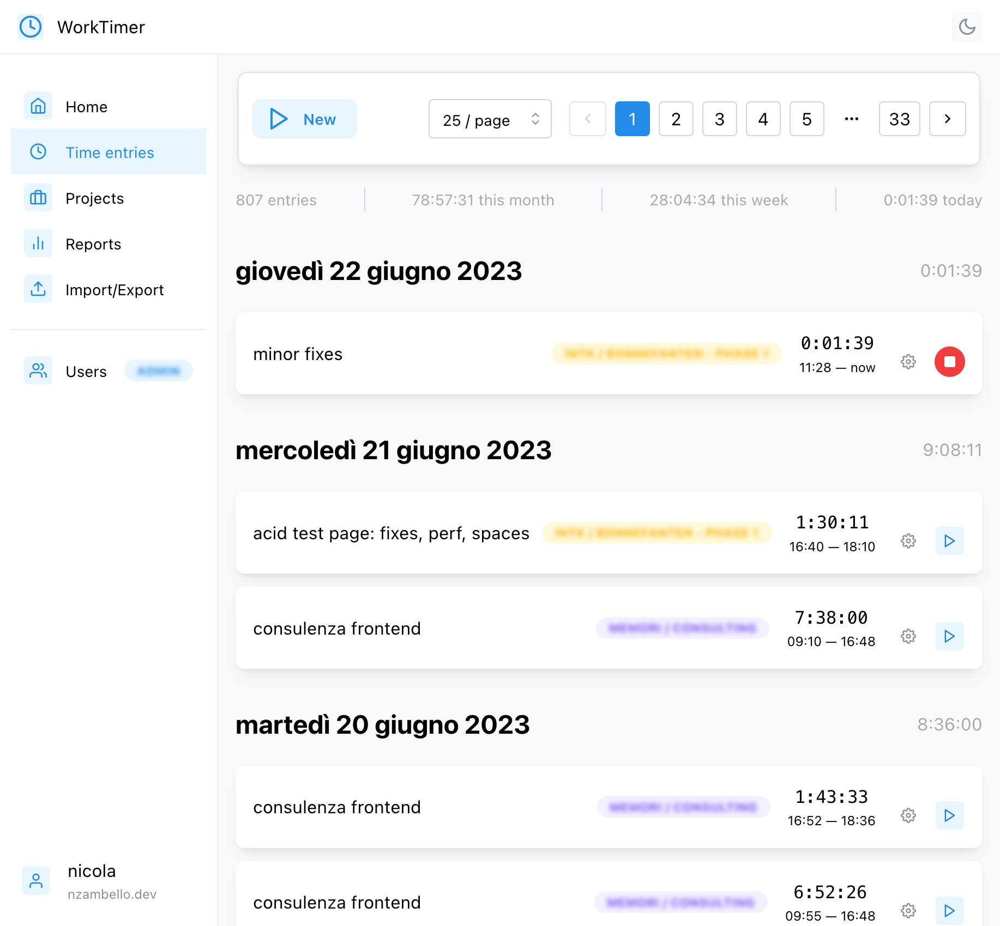
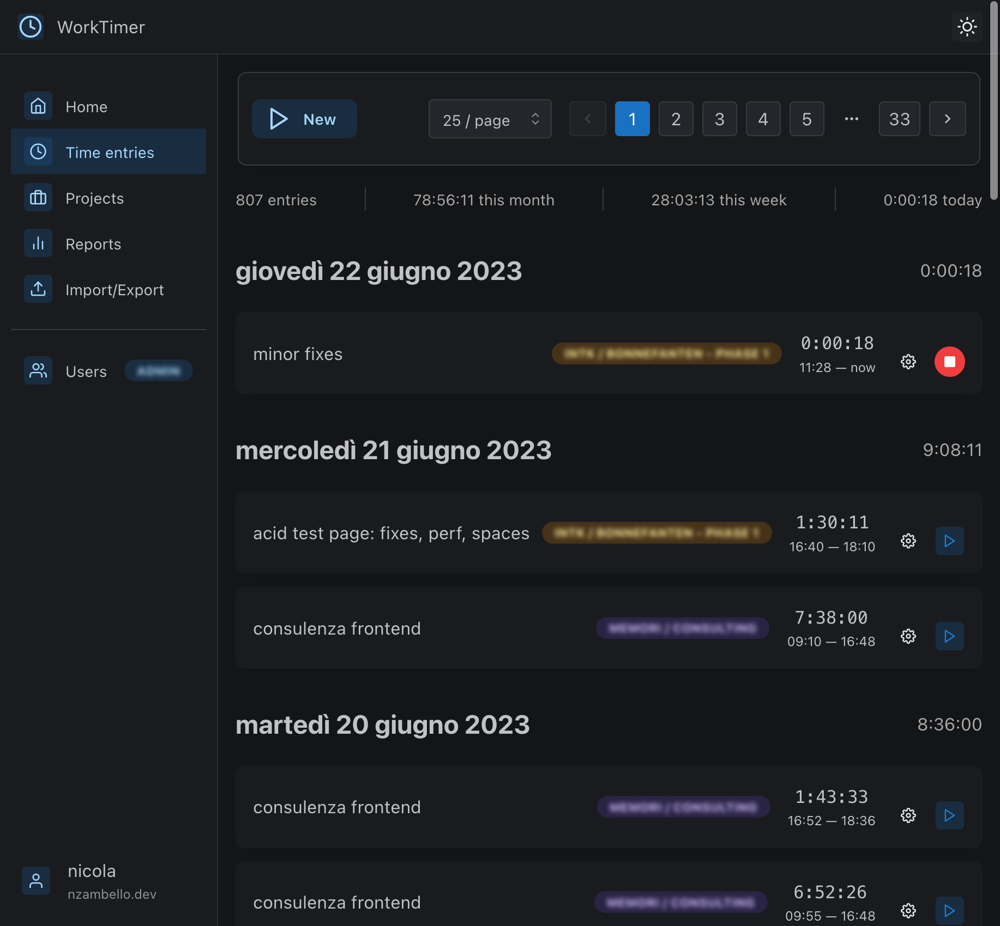
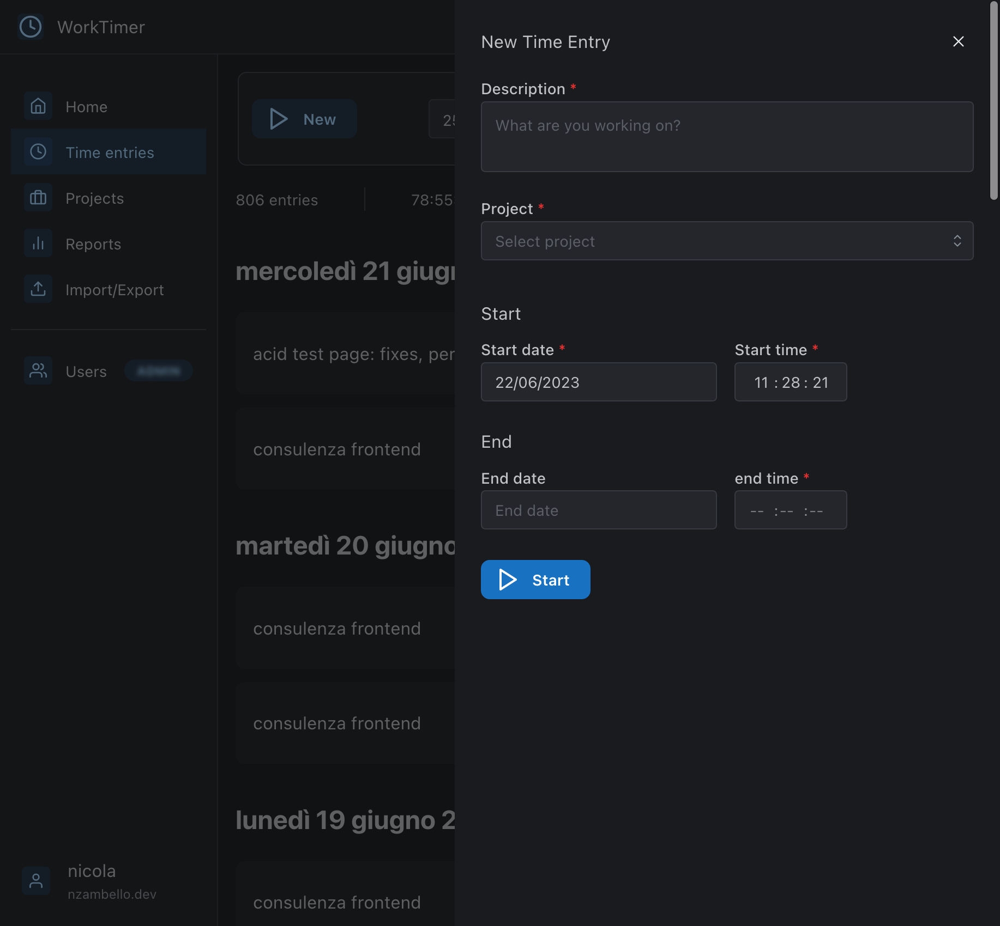
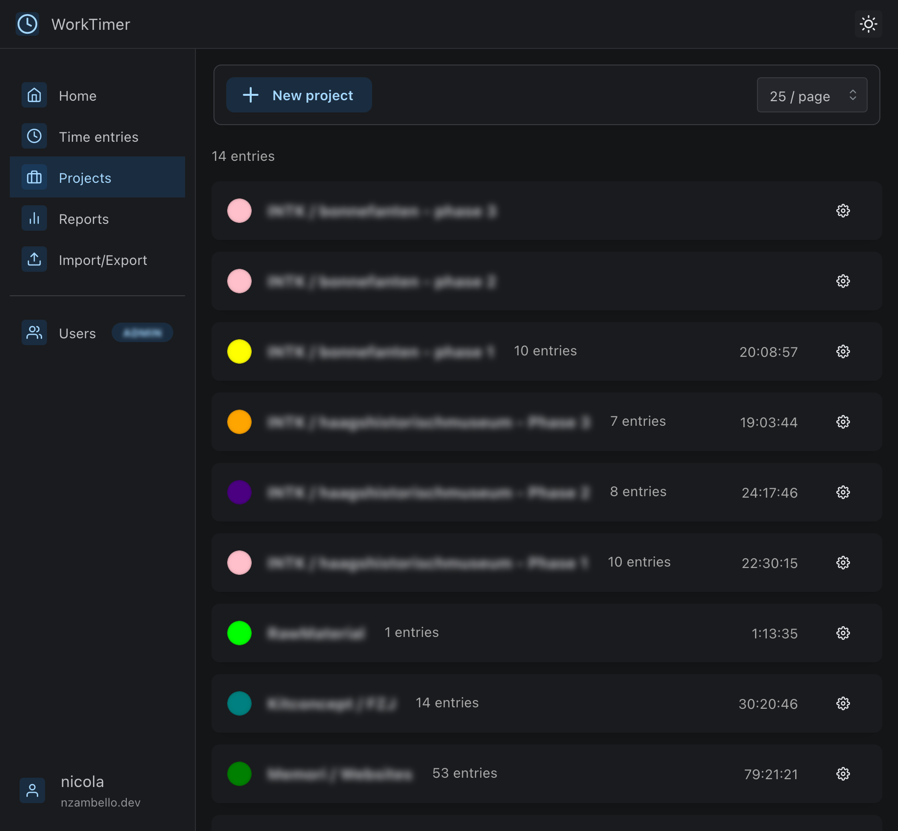
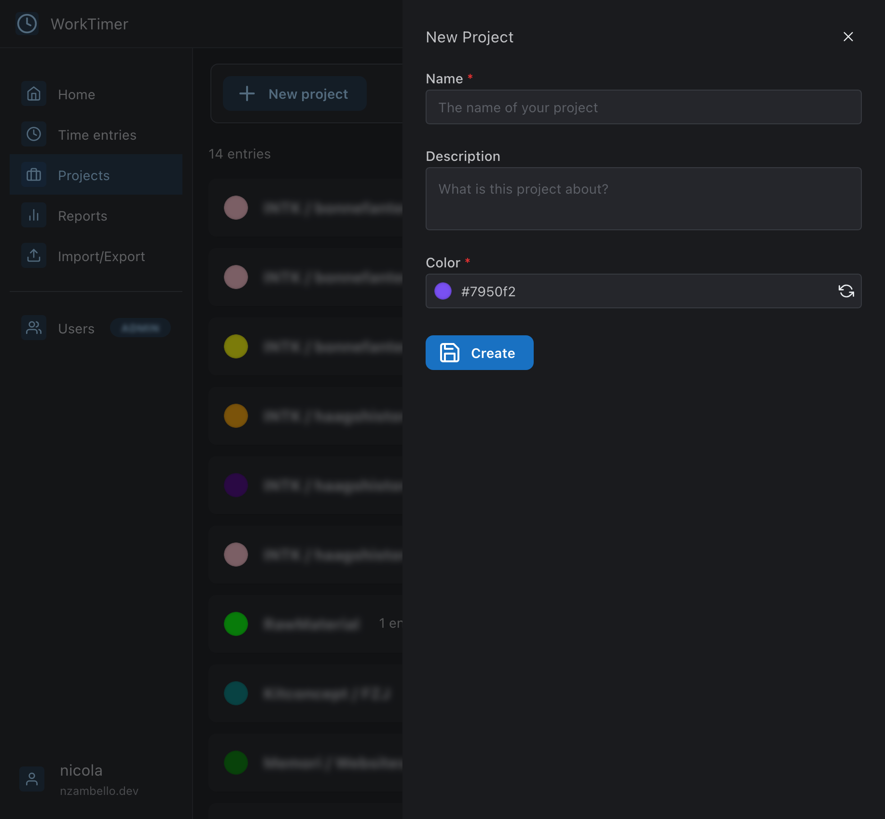
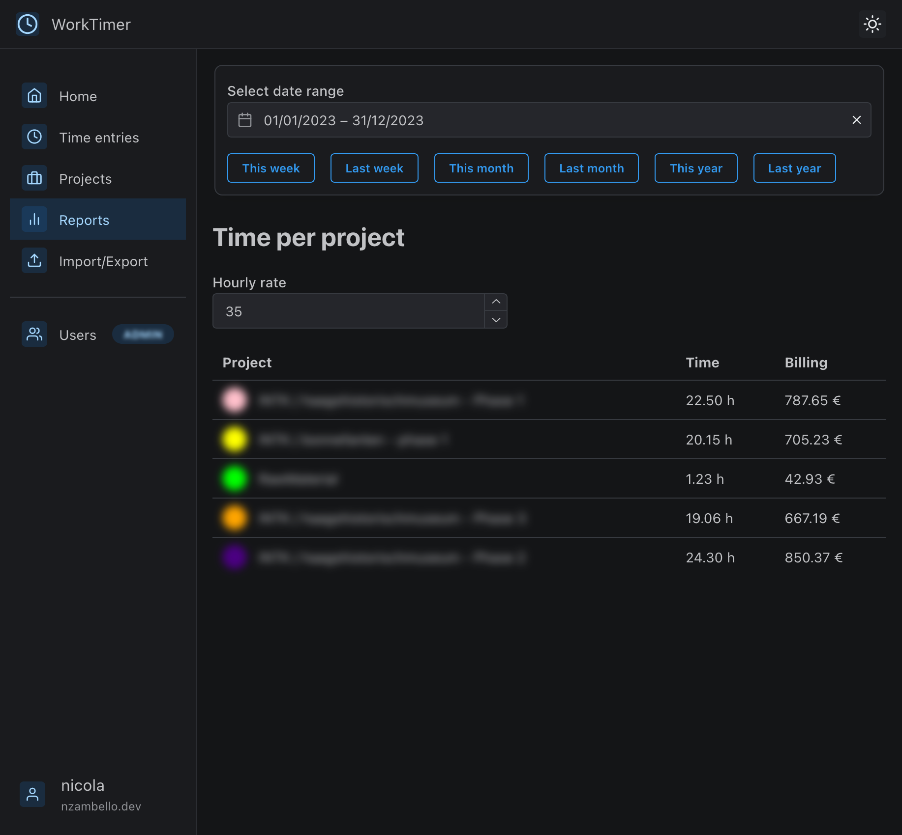

# WorkTimer


Time tracking app built with Remix, supports authentication, projects management, and monthly or custom reports.

Built for self-hosting: host it anywhere you want, and use it for free. Your time, your data.

## Table of contents

- [Features](#features)
- [Pre-built Docker image](#pre-built-docker-image)
  - [Docker compose](#docker-compose)
- [Custom deployments or development](#custom-deployment-or-development)
  - [Tech stack](#tech-stack)
  - [Running locally](#running-locally)
  - [Running with Docker](#running-with-docker)
- [Screenshots](#screenshots)
- [License](#license)

## Features

- Time entries management
- Authentication
- Multi-user support, with admin role
- Projects management
- Monthly or custom reports
- Import/Export to CSV

[Screenshots](#screenshots)

## Pre-built Docker Image

```bash
docker pull nzambello/work-timer
```

If you want to use the pre-built Docker image, you can run it with:

```bash
docker run -d -p 8080:8080 -v /path/to/data:/data/data.db nzambello/work-timer
```

If you want to use different defaults, you can build your own image. See [Running with docker](#running-with-docker)

### Docker compose

Example of docker-compose.yml with [Traefik](https://traefik.io/) as reverse proxy:

```yaml
uptime-kuma:
  depends_on:
    - watchtower
  image: nzambello/work-timer
  container_name: work-timer
  restart: always
  volumes:
    - /dockerData/work-timer:/data # Path to data for DB persistence
  labels:
    - 'com.centurylinklabs.watchtower.enable=true'
    - 'traefik.enable=true'
    - 'traefik.http.routers.work-timer.rule=Host(`timer.YOURDOMAIN.com`)'
    - 'traefik.http.routers.work-timer.entrypoints=websecure'
    - 'traefik.http.routers.work-timer.tls.certresolver=letsencrypt'
    - 'traefik.http.routers.work-timer.service=work-timer-service'
    - 'traefik.http.services.work-timer-service.loadbalancer.server.port=8080'
```

## Custom deployment or development

### Tech Stack

- [Remix](https://remix.run)
- [Prisma](https://prisma.io)
- [SQLite](https://sqlite.org)
- [Mantine](https://mantine.dev)
- [Docker](https://docker.com)

### Running Locally

```bash
# Clone the repo
git clone https://github.com/nzambello/work-timer.git
cd work-timer

# Install dependencies
yarn install

# Setup .env
cp .env.example .env
vim .env

# Start the app
yarn dev
```

### Running with Docker

```bash
# Clone the repo
git clone https://github.com/nzambello/work-timer.git
cd work-timer

# Setup .env
cp .env.example .env
vim .env

# Build the image
docker built -t work-timer .

# Start the app
docker run -p 127.0.0.1:8080:8080 work-timer
```

## Screenshots

### Light / Dark mode




### Time tracking



### Projects




### Reports



## License

[Nicola Zambello](https://github.com/nzambello) © 2023

[GNU GPLv3](./LICENSE)
